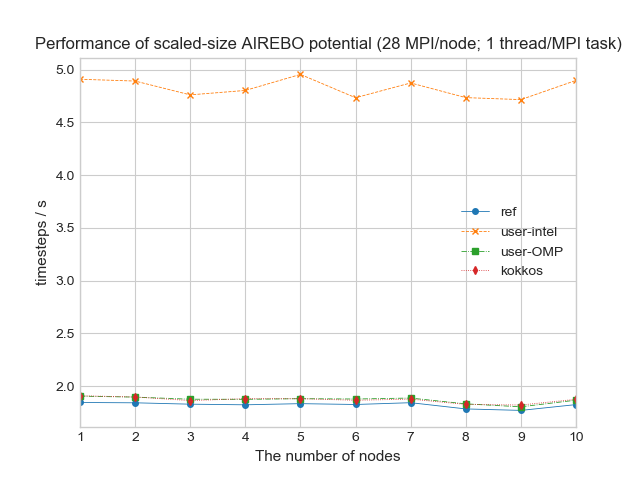

### Potentials

The following potentials are used for benchmarking:

* **in.intel.airebo** - Polyethylene benchmark with AIREBO
* **in.intel.dpd** - Dissipative Particle Dynamics
* **in.intel.eam** - Copper benchmark with Embedded Atom Method
* **in.intel.lc** - Liquid Crystal w/ Gay-Berne potential
* **in.intel.lj** - Atomic fluid (LJ Benchmark)
* **in.intel.rhodo** - Protein (Rhodopsin Benchmark)
* **in.intel.sw** - Silicon benchmark with Stillinger-Weber
* **in.intel.tersoff** - Silicon benchmark with Tersoff
* **in.intel.water** - Coarse-grain water benchmark using Stillinger-Weber

### Benchmarking results

In order to investigate the performance of different acceleration packages, the following four modes are used:

*   *ref* – default MPI only implementation. No acceleration packages used
*   *use-intel* – a package with optimised implementation for Intel CPUs by running in single, mixed, or double precision with vectorization
*   *user-omp* – a package with optimised OpenMP implementation
*   *kokkos* – a package with optimised implementation using Kokkos accelerator abstraction framework

Each potential is run with the four modes above.

#### AIREBO

The plot on the left hand side below shows the performance for a fixed-size system (522240 atoms) scaling from 1 computer node to 10, 
whilst the plot on the right hand side is the scaled-size performance for runs with 18651 atoms/proc. Click on the picture for the large version.

 

#### DPD

The plot on the left hand side below shows the performance for a fixed-size system (512000 atoms) scaling from 1 computer node to 10, 
whilst the plot on the right hand side is the scaled-size performance for runs with 18286 atoms/proc. *user-intel + Intel MKL* indicates the case that the Intel MKL Mersenne Twister random number generator (RNG) is used for DPD potential. 
Click on the picture for the large version.

 

#### EAM

The plot on the left hand side below shows the performance for a fixed-size system (512000 atoms) scaling from 1 computer node to 10, 
whilst the plot on the right hand side is the scaled-size performance for runs with 18286 atoms/proc. Click on the picture for the large version.

 

#### LC

The plot on the left hand side below shows the performance for a fixed-size system (524288 atoms) scaling from 1 computer node to 10, 
whilst the plot on the right hand side is the scaled-size performance for runs with 18725 atoms/proc. Click on the picture for the large version.

 

#### LJ

The plot on the left hand side below shows the performance for a fixed-size system (512000 atoms) scaling from 1 computer node to 10, 
whilst the plot on the right hand side is the scaled-size performance for runs with 18286 atoms/proc. Click on the picture for the large version.

 

#### RHODO

The plot on the left hand side below shows the performance for a fixed-size system (512000 atoms) scaling from 1 computer node to 10, 
whilst the plot on the right hand side is the scaled-size performance for runs with 18286 atoms/proc. Click on the picture for the large version.

 

#### SW

The plot on the left hand side below shows the performance for a fixed-size system (512000 atoms) scaling from 1 computer node to 10, 
whilst the plot on the right hand side is the scaled-size performance for runs with 18286 atoms/proc. Click on the picture for the large version.

 

#### TERSOFF

The plot on the left hand side below shows the performance for a fixed-size system (512000 atoms) scaling from 1 computer node to 10, 
whilst the plot on the right hand side is the scaled-size performance for runs with 18286 atoms/proc. Click on the picture for the large version.

 

#### WATER

The plot on the left hand side below shows the performance for a fixed-size system (512000 atoms) scaling from 1 computer node to 10, 
whilst the plot on the right hand side is the scaled-size performance for runs with 18286 atoms/proc. Click on the picture for the large version.

 

